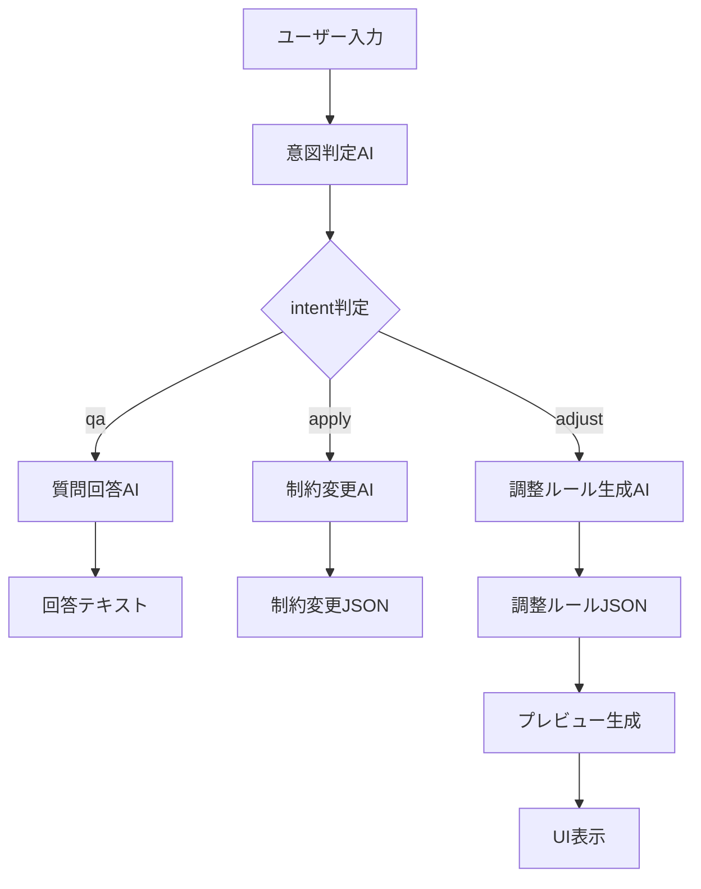

# LLMチャット機能の処理フロー

## 概要

このドキュメントでは、シフト微調整LLM統合機能の処理フローについて説明します。

## 全体の処理フロー図



## 詳細な処理フロー

### 1. 意図判定フェーズ

```
ユーザー入力
    ↓
意図判定AI (detect_intent)
    ↓
{"intent": "qa/apply/adjust", "confidence": 0.85}
```

**システムプロンプト**:
```
You are an intent router for a shift optimization assistant. 
Return JSON with keys intent and confidence. 
intent is 'qa', 'apply', or 'adjust'.
```

### 2. 意図に応じた分岐処理

#### 2.1 質問回答 (qa)

```
質問回答AI (generate_qa)
    ↓
回答テキスト
```

**例**:
- 入力: 「なぜこのシフトになったの？」
- 出力: 「現在のシフトは最適化アルゴリズムによって生成されました...」

#### 2.2 制約変更 (apply)

```
制約変更AI (generate_apply)
    ↓
制約変更JSON
```

**例**:
- 入力: 「週末の最小人員を2人にして」
- 出力: `{"type": "patch", "patch": [{"op": "replace", "path": "/min_staff_weekend", "value": 2}]}`

#### 2.3 シフト調整 (adjust)

```
調整ルール生成AI (generate_adjustment_rule)
    ↓
調整ルールJSON
    ↓
プレビュー生成 (generate_preview)
    ↓
UI表示
```

**例**:
- 入力: 「田中さんと清水さんを同時に入れないでください」
- 出力: `{"type": "pair_not_together", "parameters": {"employee_ids": [1, 17]}}`

## 各AIの役割と責任

| AI | 入力 | 出力 | 責任範囲 |
|----|------|------|----------|
| **意図判定AI** | 自然言語テキスト | `{"intent": "qa/adjust/apply", "confidence": 0.85}` | 入力の種類を判定 |
| **質問回答AI** | 質問テキスト | 回答テキスト | シフトに関する質問に回答 |
| **調整ルール生成AI** | 調整指示テキスト | 調整ルールJSON | シフト調整ルールを生成 |
| **制約変更AI** | 制約変更指示テキスト | 制約変更JSON | 最適化制約を変更 |

## システムプロンプト一覧

### 意図判定プロンプト
```
You are an intent router for a shift optimization assistant. 
Return JSON with keys intent and confidence. 
intent is 'qa', 'apply', or 'adjust'.
```

### 調整ルール生成プロンプト
```
You are a shift adjustment rule generator. Generate adjustment rules from natural language. 
Output concise assistant_text and a strict JSON rule object. 
Rule types: pair_not_together, increase_staff_day, redistribute_shifts, time_slot_adjustment. 
Return only a short explanation first then JSON.
```

### 質問回答プロンプト
```
You are a helpful assistant for a call center shift optimization tool. 
Answer briefly and clearly in Japanese.
```

### 制約変更プロンプト
```
You are an assistant that proposes constraint changes for a shift optimizer. 
Output concise assistant_text and a strict JSON object named spec with either: 
{'type':'patch','patch':[{'op':'replace','path':'/min_staff_weekend','value':2}]} 
or {'type':'full','full':{...full constraints json...}}. 
Return only a short explanation first then JSON.
```

## 実装ファイル

| 機能 | ファイル | 関数 |
|------|----------|------|
| 意図判定 | `hokkoku_backend/app/services/openai_client.py` | `detect_intent()` |
| 調整ルール生成 | `hokkoku_backend/app/services/openai_client.py` | `generate_adjustment_rule()` |
| 質問回答 | `hokkoku_backend/app/services/openai_client.py` | `generate_qa()` |
| 制約変更 | `hokkoku_backend/app/services/openai_client.py` | `generate_apply()` |
| ルーティング | `hokkoku_backend/app/services/intent.py` | `route()` |
| APIエンドポイント | `hokkoku_backend/app/routers/chat.py` | `shift_adjust()` |

## 設定値

### モデル設定
- **モデル**: `gpt-4o-mini` (環境変数 `OPENAI_MODEL`)
- **Temperature**: 
  - 意図判定: `0`
  - 調整ルール生成: `0.2`
  - 質問回答: `0.3`
- **Max Tokens**:
  - 意図判定: `60`
  - 調整ルール生成: `500`
  - 質問回答: `300`

### タイムアウト設定
- **QA**: `OPENAI_TIMEOUT_QA_MS` (デフォルト: 5000ms)
- **Apply**: `OPENAI_TIMEOUT_APPLY_MS` (デフォルト: 10000ms)

## エラーハンドリング

### フォールバック戦略
1. **LLM応答失敗時**: 意図判定は "qa" として処理
2. **JSON解析失敗時**: 最大3回リトライ
3. **ネットワークエラー時**: デフォルト応答を返す

### モックモード
環境変数 `MOCK_OPENAI=true` 時は、実際のLLM APIを呼び出さずに固定のレスポンスを返す。

## パフォーマンス特性

### 応答時間
- **意図判定**: ~1-2秒
- **調整ルール生成**: ~2-5秒
- **質問回答**: ~1-3秒

### 信頼度
- **意図判定精度**: 85%以上（confidence > 0.85）
- **閾値**: `INTENT_THRESHOLD` (デフォルト: 0.7)
